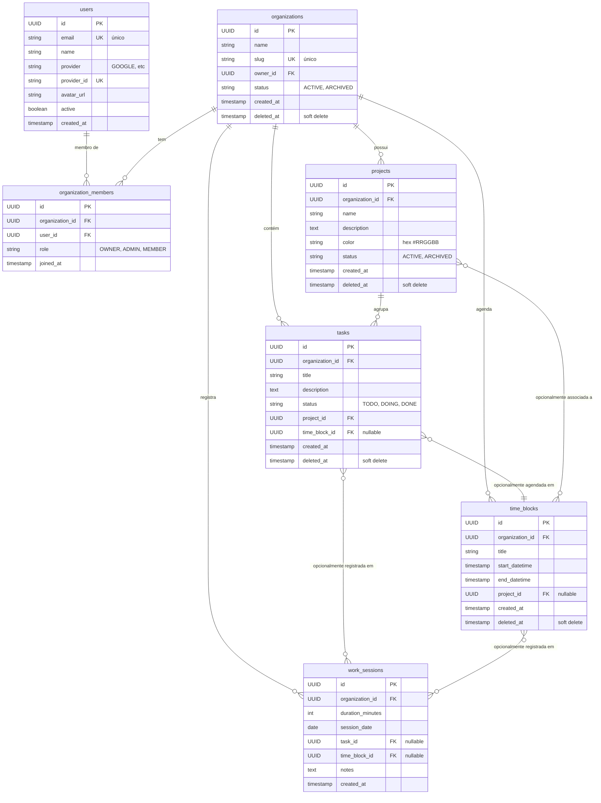

# Kairos MVP – Product Requirements Document (PRD)

## 1. Product Vision

**Kairos** is a time-centered productivity system where **only executed work counts as progress**.

The product helps users plan their time, manage tasks, and measure real execution across work, study, and client management — all in one place.

Kairos combines:

* Calendar-based time planning (Google Calendar–like)
* Task and workflow management (Linear-style Kanban)
* Real execution tracking (time logs as the single source of truth)

---

## 2. Problem Statement

Most productivity tools either:

* Focus on **planning** (calendars) without validating execution, or
* Focus on **tasks** without accounting for real time spent.

As a result, users confuse **planned time** with **actual progress**.

Kairos solves this by clearly separating:

* **Intention** (time blocks and tasks)
* **Reality** (execution logs)

Only what is executed and logged is considered progress.

---

## 3. Target Users

Primary users:

* Developers and students
* Professionals managing multiple projects
* Freelancers managing clients

User characteristics:

* Already use calendars and task tools
* Feel friction switching between tools
* Care about time awareness and consistency

---

## 4. Core Principles (Non‑Negotiable)

1. **Time blocks are intentions, not execution**
2. **Execution logs are the only source of truth**
3. **Tasks marked as done must have execution recorded**
4. **Projects are life/work contexts, not folders**
5. **Time is the central axis of the system**

---

## 5. Core Entities (MVP)

### 5.1 Project

Represents a long‑term context or objective.

Examples:

* Study English
* University – Algorithms
* Client João

Fields:

* id
* name
* description
* color
* status (active / archived)
* createdAt

Notes:

* Clients are represented as projects
* No separate CRM entity exists in MVP

---

### 5.2 Task

Represents a unit of work.

Fields:

* id
* title
* description
* status (todo / doing / done)
* projectId
* optional timeBlockId

Rules:

* Tasks may exist without a scheduled time
* Tasks can be moved through Kanban stages
* Task can only be marked as **done** if execution time is logged

---

### 5.3 Time Block (Calendar Event)

Represents reserved time in the agenda.

Fields:

* id
* title
* startDateTime
* endDateTime
* projectId (optional)

Rules:

* Time blocks do not generate progress
* A time block may contain multiple tasks
* Time blocks may pass without execution

---

### 5.4 Execution Log

Represents real work performed.

Fields:

* id
* durationMinutes
* date
* projectId
* taskId (optional)
* timeBlockId (optional)
* notes

Rules:

* Only execution logs generate metrics
* Logs may exist without task or time block

---

## 6. User Flows (MVP)

### 6.1 Planning Flow

1. User creates a project
2. User creates tasks inside the project
3. User schedules time blocks in the calendar

---

### 6.2 Execution Flow

1. User enters a time block or works freely
2. User manually logs execution time
3. User optionally links log to a task
4. Task may transition to "done" after logging

---

### 6.3 Review Flow

1. User views daily/weekly summary
2. User checks project progress
3. User compares planned vs executed time

---

## 7. Functional Requirements

### 7.1 Calendar

* Daily, weekly and monthly views
* Create, edit and delete time blocks
* Associate time blocks with projects

---

### 7.2 Kanban (Tasks)

* Three columns: To Do, Doing, Done
* Drag and drop between columns
* Filter by project and date

---

### 7.3 Execution Logging

* Manual time logging
* Attach logs to tasks and/or time blocks
* Prevent task completion without logs

---

### 7.4 Projects

* Create and manage projects
* View tasks, time blocks and execution logs
* Display total executed time

---

### 7.5 Metrics (MVP)

* Total executed time per project
* Daily and weekly execution summary
* Consistency (active days)

---

## 8. Non‑Goals (Explicitly Out of Scope for MVP)

* AI suggestions or automation
* Automatic task scheduling
* Goals or quotas
* Dedicated CRM module
* Team collaboration

---

## 9. Success Criteria (MVP)

The MVP is successful if users can:

* Plan their time clearly
* Execute work intentionally
* See real progress based on time
* Manage studies, work and clients in one system

---

## 10. Future Considerations (Post‑MVP)

* Smart scheduling suggestions
* Goal tracking
* Mobile optimization
* Team support
* Automation rules

---

## 11. Technical Architecture

### 11.1 Architectural Style

Kairos backend follows **Clean/Hexagonal Architecture** to ensure maintainability, testability, and separation of concerns:

```
┌─────────────────────────────────────────────────────────┐
│                    PRESENTATION LAYER                   │
│  (Controllers, DTOs, Security, Exception Handlers)      │
└────────────────────┬────────────────────────────────────┘
                     │
┌────────────────────▼────────────────────────────────────┐
│                   APPLICATION LAYER                     │
│           (Use Cases, Business Logic)                   │
└────────────────────┬────────────────────────────────────┘
                     │
┌────────────────────▼────────────────────────────────────┐
│                     DOMAIN LAYER                        │
│     (Entities, Domain Exceptions, Validators)           │
│  ❌ FRAMEWORK-AGNOSTIC - No Spring/JPA dependencies     │
└────────────────────┬────────────────────────────────────┘
                     │
┌────────────────────▼────────────────────────────────────┐
│                  INFRASTRUCTURE LAYER                   │
│  (JPA Entities, Repositories, External Integrations)    │
└─────────────────────────────────────────────────────────┘
```

**Key Architectural Principles:**

- **Core Isolation**: Domain layer has ZERO framework dependencies
- **Ports & Adapters**: All external interactions go through interfaces (ports)
- **Dependency Inversion**: Core defines interfaces; infrastructure implements them
- **Use Case-Driven**: Business logic organized by use cases, not CRUD

### 11.2 Technology Stack

| Component | Technology | Version |
|-----------|------------|---------|
| **Backend Framework** | Spring Boot | 4.0.1 |
| **Language** | Java | 21 |
| **Database** | PostgreSQL | 16.8 |
| **Migrations** | Flyway | - |
| **Cache** | Redis | 7-alpine |
| **Security** | Spring Security + OAuth2 + JWT | - |
| **Testing** | JUnit 5, Testcontainers, Mockito | - |
| **Build Tool** | Maven | - |
| **Deployment** | Docker, GitHub Actions | - |
| **Infrastructure** | VPS (4 CPUs / 8GB RAM) | - |

---

## 12. Data Model

### 12.1 Multi-Tenancy

Kairos supports **multi-tenant architecture** using Organizations:

- Each user can belong to multiple **Organizations**
- All data (Projects, Tasks, TimeBlocks, WorkSessions) is scoped to an **Organization**
- **Organization Members** have roles: OWNER, ADMIN, MEMBER
- Enables future B2B/team collaboration features

### 12.2 Entities

#### User (Authentication)
```
- id: UUID (PK)
- email: String (unique)
- name: String
- provider: String (GOOGLE, etc.)
- providerId: String
- avatarUrl: String (optional)
- active: Boolean
- createdAt: Instant
```

#### Organization
```
- id: UUID (PK)
- name: String
- slug: String (unique)
- ownerId: UUID → User.id
- status: ACTIVE / ARCHIVED
- createdAt: Instant
- deletedAt: Instant (soft delete)
```

#### OrganizationMember
```
- id: UUID (PK)
- organizationId: UUID → Organization.id
- userId: UUID → User.id
- role: OWNER / ADMIN / MEMBER
- joinedAt: Instant
```

#### Project
```
- id: UUID (PK)
- organizationId: UUID → Organization.id
- name: String
- description: String
- color: String (hex #RRGGBB)
- status: ACTIVE / ARCHIVED
- createdAt: Instant
- deletedAt: Instant (soft delete)
```

#### Task
```
- id: UUID (PK)
- organizationId: UUID → Organization.id
- title: String
- description: String
- status: TODO / DOING / DONE
- projectId: UUID → Project.id
- timeBlockId: UUID → TimeBlock.id (optional)
- createdAt: Instant
- deletedAt: Instant (soft delete)
```

#### TimeBlock
```
- id: UUID (PK)
- organizationId: UUID → Organization.id
- title: String
- startDateTime: Timestamp
- endDateTime: Timestamp
- projectId: UUID → Project.id (optional)
- createdAt: Instant
- deletedAt: Instant (soft delete)
```

#### WorkSession
```
- id: UUID (PK)
- organizationId: UUID → Organization.id
- durationMinutes: Integer
- sessionDate: Date
- taskId: UUID → Task.id (optional)
- timeBlockId: UUID → TimeBlock.id (optional)
- notes: String
- createdAt: Instant
```

**Note**: WorkSessions use **physical deletion** (not soft delete) for performance.

### 12.3 Entity-Relationship Diagram



### 12.4 Data Integrity Rules

1. **Task Completion**: Task can only be marked as `DONE` if at least one WorkSession exists with `taskId`
2. **Soft Delete Cascade**: Deleting a Project should soft-delete all associated Tasks
3. **Time Range**: `endDateTime` must be > `startDateTime` for TimeBlocks
4. **Minimum Duration**: `durationMinutes` must be >= 1
5. **Organization Membership**: All data access must validate user is member of the organization

### 12.5 Database Indexes

Partial indexes (PostgreSQL feature) are used for performance:

```sql
-- Only index non-deleted records
CREATE INDEX idx_tasks_active ON tasks(organization_id, status)
WHERE deleted_at IS NULL;

-- Calendar queries
CREATE INDEX idx_timeblocks_range ON time_blocks(start_datetime, end_datetime)
WHERE deleted_at IS NULL;

-- Metrics queries
CREATE INDEX idx_sessions_org_date ON work_sessions(organization_id, session_date);
```

---

## 13. API Contracts

### 13.1 RESTful Conventions

- **Resource-based URLs**: `/projects/{id}`, `/tasks`, `/time-blocks`
- **HTTP Methods**: GET (read), POST (create), PATCH (update), DELETE (soft delete)
- **Status Codes**:
  - `200 OK` - Successful GET/PATCH
  - `201 Created` - Successful POST
  - `204 No Content` - Successful DELETE
  - `400 Bad Request` - Validation errors
  - `403 Forbidden` - Authorization errors
  - `404 Not Found` - Resource not found
  - `500 Internal Server Error` - Unexpected errors

### 13.2 Versioning

**Header-based versioning** (preferred):

```
X-API-Version: 1.0
```

Default version is `1.0` if header not provided.

### 13.3 Response Format

All responses follow a standard envelope:

**Success Response:**
```json
{
  "success": true,
  "data": {
    "id": "uuid",
    "name": "Project Name",
    ...
  },
  "error": null,
  "timestamp": "2025-01-15T10:30:00Z",
  "apiVersion": "1.0"
}
```

**Error Response:**
```json
{
  "success": false,
  "data": null,
  "error": {
    "code": "VALIDATION_ERROR",
    "message": "Name is required",
    "details": null
  },
  "timestamp": "2025-01-15T10:30:00Z",
  "apiVersion": "1.0"
}
```

### 13.4 Error Codes

| Code | HTTP Status | Description |
|------|-------------|-------------|
| `VALIDATION_ERROR` | 400 | Request validation failed |
| `DOMAIN_ERROR` | 400 | Business rule violation |
| `NOT_FOUND` | 404 | Resource not found |
| `ACCESS_DENIED` | 403 | User not authorized |
| `INTERNAL_ERROR` | 500 | Unexpected server error |

---

## 14. Security

### 14.1 Authentication

**OAuth2 + Google Login** flow:

1. Frontend redirects to `/oauth2/authorization/google`
2. User authenticates with Google
3. Google redirects back to `/login/oauth2/code/google`
4. Backend creates/updates User record
5. Backend generates JWT tokens:
   - **Access Token**: 15 minutes expiration
   - **Refresh Token**: 7 days expiration
6. Tokens returned in JSON response

### 14.2 JWT Token Structure

```json
{
  "sub": "user-uuid",
  "email": "user@example.com",
  "name": "User Name",
  "iat": 1736944200,
  "exp": 1736955000
}
```

### 14.3 Authorization

- **Stateless**: No server-side sessions
- **Bearer Token**: JWT sent in `Authorization: Bearer <token>` header
- **Organization Scope**: All requests include `organizationId` for multi-tenancy
- **Role-Based Access** (future):
  - `OWNER`: Full access
  - `ADMIN`: Manage projects/members
  - `MEMBER`: Read/write own content

### 14.4 Input Validation

Two-level validation:

1. **DTO Level** (Bean Validation):
   - `@NotNull`, `@NotBlank`, `@Size`, `@Pattern`
   - Structural validation (required fields, format)

2. **Use Case Level** (Business Rules):
   - Cross-field validation
   - Domain invariants
   - Organization membership validation

---

## 15. Non-Functional Requirements

### 15.1 Performance

| Metric | Target | Measurement |
|--------|--------|-------------|
| **API Response Time** | < 200ms (p95) | All endpoints |
| **Concurrent Users** | 100 → 1000 | Scalable |
| **Database Query Time** | < 50ms (p95) | Indexed queries |
| **Cache Hit Rate** | > 80% | Redis cache |

### 15.2 Availability

- **Uptime Target**: 99.9%
- **Deployment Strategy**: Blue-green deployment (zero downtime)
- **Health Checks**: `/actuator/health` endpoint
- **Backup**: Daily PostgreSQL backups

### 15.3 Scalability

- **Horizontal Scaling**: Stateless application supports multiple instances
- **Database**: PostgreSQL connection pooling (HikariCP)
- **Cache**: Redis for distributed caching
- **Load Balancer**: Nginx or cloud load balancer (future)

### 15.4 Observability

- **Logging**: Structured JSON logs
- **Metrics**: Micrometer + Prometheus endpoint
- **Tracing**: OpenTelemetry (future)
- **Monitoring**: Actuator health endpoints

---

## 16. Deployment & Operations

### 16.1 Environment Strategy

- **Development**: Docker Compose (PostgreSQL + Redis + App)
- **Production**: VPS (4 CPUs / 8GB RAM) with Docker Compose
- **CI/CD**: GitHub Actions

### 16.2 Docker Services

```yaml
services:
  postgres:
    image: postgres:16.8-alpine
    ports: ["5432:5432"]
    volumes: [postgres_data:/var/lib/postgresql/data]

  redis:
    image: redis:7-alpine
    ports: ["6379:6379"]
    volumes: [redis_data:/data]

  app:
    build: .
    ports: ["8080:8080"]
    depends_on: [postgres, redis]
```

### 16.3 CI/CD Pipeline

**GitHub Actions**:

1. **On Push/Pull Request**:
   - Run unit tests
   - Run integration tests
   - Check test coverage (80%+)
   - Build Docker image

2. **On Merge to Main**:
   - Deploy to production VPS
   - Run smoke tests
   - Monitor health checks

### 16.4 Environment Variables

| Variable | Description | Example |
|----------|-------------|---------|
| `SPRING_PROFILES_ACTIVE` | Environment | `prod` |
| `SPRING_DATASOURCE_URL` | Database URL | `jdbc:postgresql://...` |
| `GOOGLE_OAUTH_CLIENT_ID` | OAuth2 Client ID | `...apps.googleusercontent.com` |
| `GOOGLE_OAUTH_CLIENT_SECRET` | OAuth2 Secret | `GOCSPX-...` |
| `JWT_SECRET` | JWT Signing Key | Base64-encoded secret |
| `SPRING_REDIS_HOST` | Redis Host | `redis` |

---

## 17. Development Standards

### 17.1 Code Quality

- **Test Coverage**: 80%+ minimum (JaCoCo)
- **Code Review**: Required for all changes
- **Linting**: Zero SonarQube warnings
- **Documentation**: Javadoc for public APIs

### 17.2 Testing Strategy

| Test Type | Scope | Tool |
|-----------|-------|------|
| **Unit Tests** | Use cases, domain logic | JUnit 5 + Mockito |
| **Integration Tests** | Persistence, controllers | Testcontainers |
| **E2E Tests** | Critical flows | WebDriver/Playwright (future) |

### 17.3 Git Workflow

- **Main Branch**: `main` (production-ready)
- **Development Branch**: `develop` (integration)
- **Feature Branches**: `feature/feature-name`
- **Commit Messages**: Conventional Commits

---

**Kairos MVP is focused on clarity, honesty with time, and intentional execution.**
